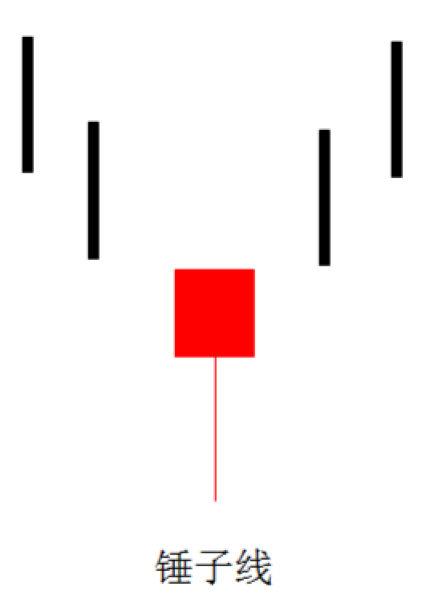
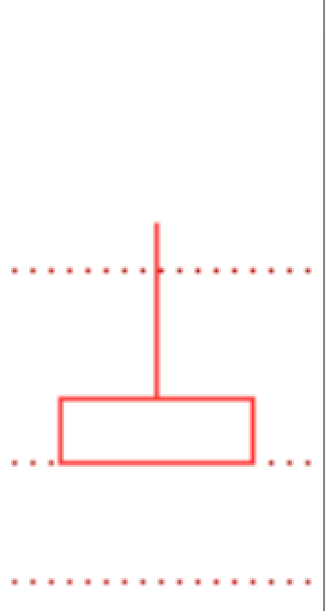
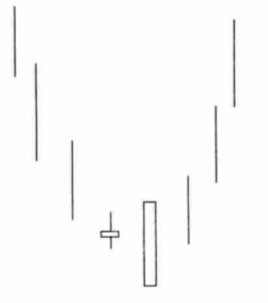
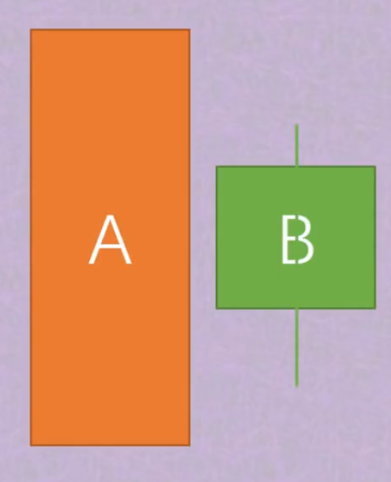

# 抄底形态

## 锤子线

1. 组成：由长下影线（允许出现少量上影线，但不能太长）、实体组成
2. 结构：下影线是实体部分的两倍以上
3. 位置：出现在明显的下行趋势中
4. 成交量：不能缩量，至少要和平均成交量持平，最好是明显放大，越大越有效

###### 意义：

行情大概率止跌，反弹，但反弹高度无法确定，取决于综合因素。

## 倒锤子线

1. 组成：由长上影线（允许出现少量下影线，但不能太长）、实体组成
2. 结构：上影线是实体部分的两倍以上
3. 位置：出现在明显的下行趋势中
4. 成交量：**必须明显放大，越大越有效（和锤子线不同）**

#### 意义：

通常出现在行情止跌前，预示行情可能即将止跌，底部即将来临，提前预判，做好抄底准备，或者避免在接近底部位置割肉

#### 和锤子线的区别：

没有锤子线的抄底信号强烈，但提前警告，如果配合锤子线，成功率大增。

**买点：** 后面交易日收盘价（通常在5个交易日以内，越少越好），超过倒锤子线实体上沿。

**失效：** 买点出现后，如果在后续行情发展中（超过倒锤子线实体上沿后5个交易日内），又再次跌破倒锤子线实体下沿，形态失效。

**虚假信号：** 成交量没有明显放大，不是倒锤子线。

**重要提醒：** 技术指标不能100%确认行情，只能帮助我们提升胜率，要控制仓位，勿重仓抄底。

## W底构成

W底也就是常说的双重底，它是重要的底部特征，属于强烈的反转上涨信号，后期通常伴随着较大的涨幅，属于抄底结构形态之一。

#### W底构成6要素：

1. 出现在一段明显的下跌趋势中
2. 运行方式，股价跌至某一位置A低点，**出现至少10%的反弹**，反弹至H高点，随后继续下跌，当跌至A点低点价格附近时，再次止跌形成B低点，随后再次反弹，突破颈线H，形成W型
3. A点到B点，周期越长越好，至少要半个月时间，最好一个月以上
4. B点通常和A点持平或略高，但偶尔发生B点低于A点的情况，不低于3%，极限不超过5%
5. A点附近的成交量，不能严重大于B点附近的成交量，B点附近成交量可以放大
6. 价格放量突破颈线，即H高点价格（简化版），形成W底

#### W底形成后的最小涨幅测算：

- A点和B点连线，到颈线的垂直距离
- 以AB低点，取最小值，到颈线的距离

#### 买点：

**激进：** 放量突破颈线后，直接买入，止损点放在颈线下方，给一定容错率，3%以内

优点：吃到最大涨幅

缺点：容易碰到假突破，打止损

**稳妥：** 放量突破颈线后，观察三到五个交易日，看是否有缩量回踩颈线的动作，回踩不破，买入

优点：确认突破有效，避免被频繁打止损

缺点：如果不回踩颈线，直接拉升，买入价格太高，贻误战机

## 看涨抱线

1. 组成：由连续两根K线的组合形态构成

   阴线（下跌）A

   阳线（上涨）B

2. 位置：出现在明显的下行趋势中，或下跌趋势止跌后的横盘整理过程中

3. 形成：阳线B，开盘价低于A最低点（含下影线），越低越好，收盘价高于A最高点（包含上影线）

4. 成交量：B成交量至少和近期平均成交量相同，越大越有效，缩量无效

**意义：底部信号！通常预示行情可能止跌，即将横盘整理或上涨，提前预判，做好抄底准备，或者避免在接近底部位置杀跌。**

#### 买点：

临近收盘前：确认当日收盘价大概率高于A阴线最高点，可买入（激进）

等待几个交易日：价格回落至B点实体内任意位置买入（稳妥）

#### 失效：

后续价格再次下跌，跌破B最低点（含下影线），无成交量要求！

## 看涨孕线 - 阴孕阳

1. 组成：由连续两根K线的组合形态构成

   阴线（下跌）A

   阳线（上涨）B（实体越小越好，十字K最佳）

2. 位置：出现在明显的下行趋势中，**横盘趋势无效**

3. 形成：A的实体部分，完全包裹B的实体部分，B的开盘价高于A的收盘价

4. 成交量：B无成交量要求

#### 意义：

底部信号！通常预示行情可能止跌，即将横盘整理或上涨，提前预判，做好抄底准备，或者避免在接近底部位置杀跌。

#### 买点：

临近收盘价，确认当日大概率收出看涨孕线，即可市价买入。

#### 失效：

后续价格再次下跌，跌破A最低点（含下影线），无成交量要求！

