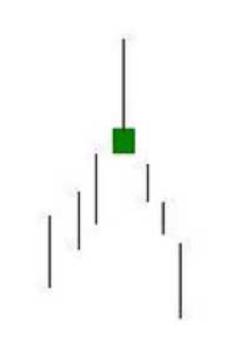
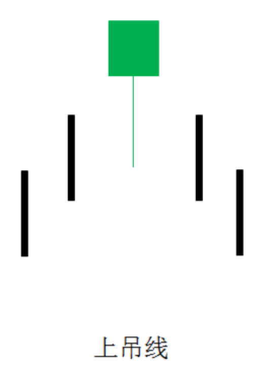
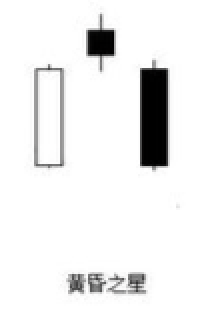
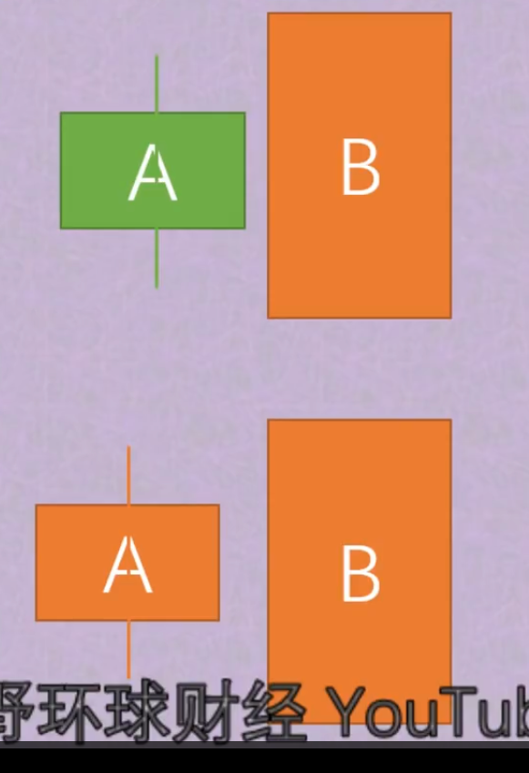
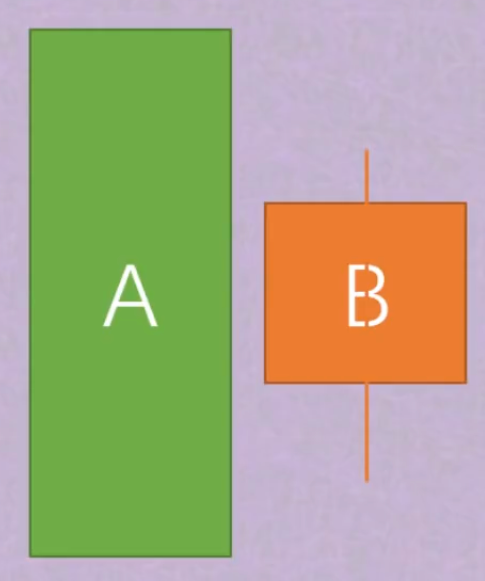
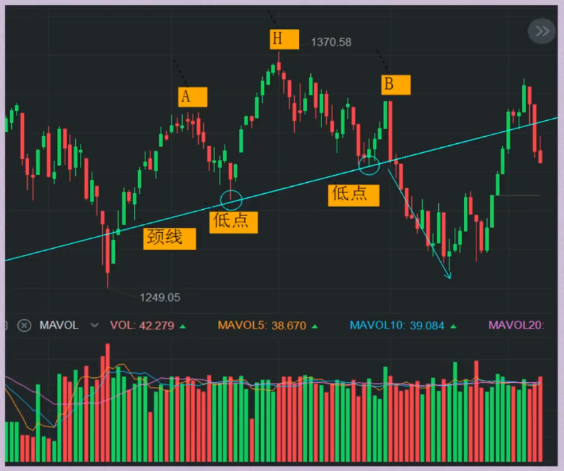

# 见顶形态

## 流星线

1. 组成：由长上影线（允许出现少量下影线，但不能太长），实体组成
2. 结构：上影线是实体部分的两倍以上
3. 位置：出现在明显的**上行趋势**中
4. 成交量：必须明显放大，远大于近期平均成交量，越大越有效

**意义：** 强烈的顶部信号！通常出现在行情见顶前，预示行情可能即将滞涨，顶部即将来临，提前预判，做好逃顶、止盈准备，或者避免在接近顶部位置追涨。

**卖点：** 出现后即可直接卖出，或者后面交易日收盘（通常在5个交易日以内，越少越好），价格低于流星线最低点（含影线）。

**失效：** 价格再次增量上涨，突破流星线最高点（含影线）。

**虚假信号：** 成交量未明显放大，不是流星线；和交易量持平，疑似流星线，提高警惕

**重要提醒：** 流星线，技术指标不能100%确认行情，只能帮助我们提升胜率，帮助我们逃顶，防止追高。请勿重仓做空。

## 上吊线

1. 组成：由长下影线（允许出现少量上影线，但不能太长）、实体组成
2. 结构：下影线是实体部分的两倍以上
3. 位置：出现在明显的**上行趋势**中
4. 成交量：必须明显放大，远大于近期平均成交量，越大越有效

**意义：** 较强烈的顶部信号！警告功能小于流星线。通常出现在行情见顶前，预示行情可能即将滞涨，顶部即将来临，提前预判，做好逃顶、止盈准备，或者避免在接近顶部位置追涨。

**卖点：**

- 出现后即可直接卖出（激进）
- 后面交易日收盘（通常在1-2交易日以内），收盘价格低于上吊线实体下沿（中性）
- 后面交易日收盘（通常在1-2交易日以内），价格低于上吊线最低点，含影线。（延迟）

**失效：** 价格再次上涨，突破流星线最高点（含影线）。

**虚假信号：** 成交量没有明显放大，不是上吊线；和交易量持平，疑似上吊线，提高警惕。

**重要提醒：** 上吊线，技术指标不能100%确认行情，只能帮助我们提升胜率，帮助我们逃顶，防止追高。请勿重仓做空。

## 黄昏之星

1. 组成：由连续三根K线的组合形态构成

   阳线（上涨）A

   十字星线（颜色不限，实体很小，有影线）B

   阴线（下跌）C

2. 位置：出现在明显的上行趋势中

3. 形成：阴线C，收盘价低于A最低点

4. 成交量：A、B没有要求，C成交量大于A和B

**意义：** 顶部信号！警告功能小于流星线和上吊线。通常出现在行情见顶前，预示行情可能即将滞涨，顶部即将来临，提前预判，做好逃顶、止盈准备，或者避免在接近顶部位置追涨。

#### 卖点：

- 盘中：疑似形成黄昏之星，C跌破A最低点，可直接卖出（激进）
- 临近收盘前：C跌破A最低点，卖出（保守）
- 移动止盈：止盈点放置于A点低点下方

**失效：** 后续价格再次上涨，突破A、B、C高点（含影线），无成交量要求！

**虚假信号：** C成交量不高于A、B，不是黄昏之星。

**重要提醒：** 技术指标不能100%确认行情，只能帮助我们提升胜率，帮助我们逃顶，防止追高。请勿重仓做空。

## 看跌抱线

1. 组成：由连续两根K线的组合形态构成

   形态一：阴抱阳

   阳线（上涨）A

   阴线（下跌）B

   形态二：阴抱阴

   阴线（下跌）A

   阴线（下跌）B

2. 位置：出现在明显的上行趋势中。或上涨趋势滞涨后的横盘整理过程中

3. 形成：阴线B，高开，开盘价高于A最高点（包含上影线），越高越好，收盘价低于A最低点（包含下影线）

4. 成交量：B成交量至少和近期平均成交量相同，越大越有效，缩量无效。

#### 意义：

顶部信号！通常预示行情可能见顶或滞涨，即将横盘整理或下跌，提前预判，做好逃顶准备，或者避免在接近顶部位置追高。

#### 卖点：

临近收盘前：确认当日收盘价大概率低于A最低点，可卖出（激进）

等待几个交易日：价格反弹至B实体，始终无法站稳B最高点，卖出（稳妥）

#### 失效：

后续价格再次上涨，涨破B最高点（含上影线），无成交量要求！

## 看跌孕线 - 阳孕阴

1. 组成：由连续两根K线的组合形态构成

   阳线（上涨）A

   阴线（下跌）B（实体越小越好，十字K最佳）

2. 位置：出现在明显的上行趋势中，横盘趋势无效

3. 形成：A的实体部分，完全包裹B的实体部分，B的开盘价低于A的收盘价，B的收盘价，高于A的开盘价

4. 成交量：B无成交量要求

#### 意义：

顶部信号！通常预示行情上涨动能衰减，即将横盘整理或下跌，提前预判，做好逃顶准备，或者避免在接近顶部位置追高。

#### 卖点：

临近收盘前，确认当日大概率收出看跌孕线，即可市价卖出或设置止盈，止盈点放在A最低点下方（含下影线）。

#### 失效：

后续价格再次上涨，涨破A最高点（含上影线），无成交量要求。

## 头肩顶

#### 什么是头肩顶？（Head & Shoulders Top）

头肩顶，是常见的K线组合结构，出现在一段上涨爬升趋势后，形成阶段顶部，市场由涨转跌，是看跌的明显形态。

#### 头肩顶的构成：

由四部分构成：左肩、头部、右肩、颈部。

三个高点价格：左肩高点A、头部最高点H、右肩高点B。

颈线：左肩A和头部H，两个高点回落最低点的连线。

高度：

- H高于A和B
- A和B谁高不重要。

成交量：大多数情况下，形成左肩A高点的爬升成交量最大。

最小跌幅：跌破颈线后，通常伴随着放量，最少跌幅为H高点到颈线的垂直距离。

#### 买点和卖点：

- B点下跌，接近颈线位置，可以尝试买入。
- 跌破颈线，必须卖出。
- 颈线下方止跌反弹，反弹至颈线，为压力位，可卖出。

## M顶形态

#### M顶定义：

M顶也就是常说的双重顶，它是重要的顶部特征，属于强烈的反转下跌信号，后期通常伴随着较大的跌幅，属于逃顶结构形态之一。

#### M顶构成5要素：

1. 出现在一段明显的上涨趋势中。
2. 运行方式，股价涨至某一位置A高点，出现至少10%顶回撤，下跌至L低点，随后开始反弹，当反弹至A高点价格附近时，再次涨至形成B高点，随后再次下跌，跌破颈线，形成M型。
3. A点到B点，周期越长越好，一个月以上比较有效。
4. B点通常比A点略低（不要低于5%）或持平，但偶尔发生B点高于A点点情况，不高于3%，极限不超过5%。
5. 价格跌破颈线（以收线为准），即L低点价格，形成M顶。

#### M顶形成后的最小跌幅测算：

以AB两点，取较小值，到颈线的垂直距离。